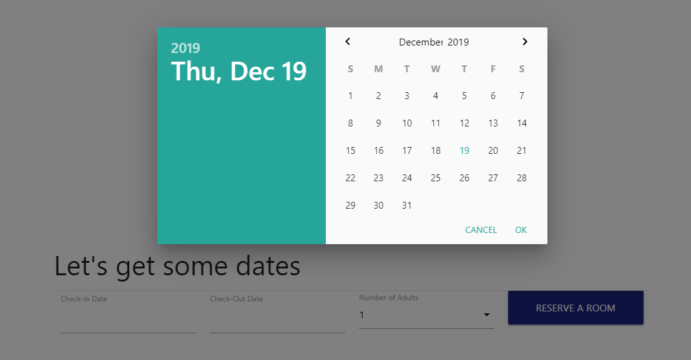
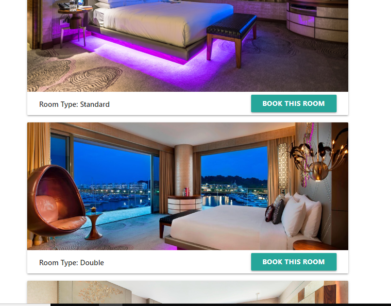
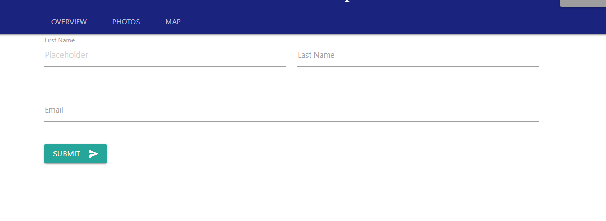
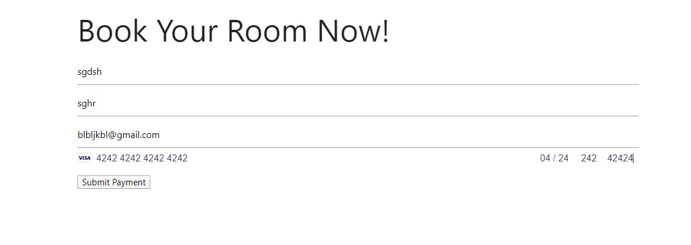

# Hot Hotel & Spa Site

This is a website for customers to book their reservations into the Hot Hotel & Spa. The site uses two different APIs, one for collecting credit card information and other for the a google maps plug. The site comprised of six different routes the user is able to take:

* /home
* /payment
* /client
* /maps
* /thankyou
* /rooms

The site will automatically navigate the user through each route to ensure that they properly booked the room they wish. Each route is designed to collect information from the user via forms which is then transferred to a database on the server to help process the reservation. Below is a list of each route's action with the reservation.

### /home

At the home page the user is able presented with a navagation bar at the top of the page that will stay with them through out the reservation process. In the navagation bar the user is able to navigate back to the home page, look at local photos of the area, or search the local surroundings with the map plugin. 

When the user is ready there is a reservation button that will send the user to the bottom of the page where the reservation form is waiting for them to fill out.

At the reservation form the user will be asked to fill out their desired check-in date, check-out date, and number of guest that will be staying at the Hot Hotel & Spa. Once submitted they will be sent to the rooms page.

### /rooms

The rooms page will dynamically display all available room within the time span of the user's check-in and check-out dates. Once the desired room is selected with the "Book this room" button, the user will be sent to the client information page.

### /client

On the client page another form will be presented to the user. It will ask for the user's first name, last name, and email. This contact information will be what the reservation will be put under. Once confirmed the user will be sent to the payment page.

### /payment

On the payment page credit card information will need to be filled out for payment to be processed. Upon completing the form the information will be sent to a secure API database to be processed once the transaction is complete. The user will be sent to the final page, the thank you page.

### /thankyou

On the thank you page the user will be presented with their Check-in date, Check-out date, the room their reserved, and the total price of the reservation

## Usage

This project was completed by using a MVC format using Mysql, handlebars, CSS, Javascript, JQuery, Materialize. Moment was used to format dates for reservation, Sequelize was used for routes, Stripe API was used for credit card payments.

## Contributing

This site was created by Raymond He, Josh Cosson, Noelle Everage, and Christina Tang. 

12/19/2019

